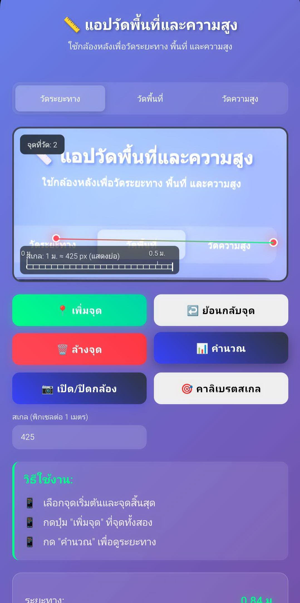

# แอปวัดระยะ วัดพื้นที่ และวัดความสูง (PWA)

⚡ วัดระยะ วัดพื้นที่ และวัดความสูง ผ่านกล้องบนเว็บ พร้อมคาลิเบรตง่าย ๆ และใช้งานออฟไลน์ได้

- 🎥 เลือกกล้องอัตโนมัติ (ซ่อน UI เพื่อความเรียบง่าย)
- 👆 แตะเพื่อวางจุด พร้อมปุ่ม Undo
- 📐 โหมด: วัดระยะ, วัดพื้นที่ (หลายจุด), วัดความสูง (แนวตั้ง)
- 🎯 คาลิเบรต: แตะ 2 จุด + กรอกระยะจริง (เมตร) เพื่อคำนวณพิกเซลต่อเมตร
- 💾 บันทึกสเกลไว้ใน localStorage
- 📏 แสดงไม้บรรทัดพร้อม tick (0 ม., 0.5 ม., 1 ม.)
- 📴 รองรับออฟไลน์ด้วย Service Worker และหน้า offline

## สารบัญ
- ฟีเจอร์
- เดโม่
- วิธีเริ่มใช้งาน/โฮสติ้ง
- วิธีเริ่มใช้งาน
- คาลิเบรต
- ไม้บรรทัดสเกล
- ออฟไลน์ (PWA)
- พัฒนา
- การ Deploy
- ความเป็นส่วนตัวและสิทธิ์
- Roadmap
- Contributing
- License

## เดโม่
เพิ่มภาพหน้าจอหรือ GIF ตัวอย่าง

## วิธีเริ่มใช้งาน
1. เปิด `index.html` ผ่าน HTTPS (หรือใช้เซิร์ฟเวอร์ในเครื่อง)
2. กดปุ่มเปิดกล้อง
3. เลือกโหมด แล้วแตะบนวิดีโอเพื่อเพิ่มจุด
4. ตั้งค่าสเกล: ใส่ค่าพิกเซลต่อ 1 เมตรเอง หรือใช้คาลิเบรต (แตะ 2 จุด + กรอกเมตรจริง)
5. กดปุ่มคำนวณ

## คาลิเบรต
- เปิดโหมดคาลิเบรต แตะสองจุดที่รู้ระยะจริง ใส่ค่าระยะ (เมตร)
- แอปจะคำนวณ px/เมตร และบันทึกลง localStorage อัตโนมัติ

## ไม้บรรทัดสเกล
- แสดงที่มุมซ้ายล่างของหน้ากล้อง
- มี tick ที่ 0 ม., 0.5 ม., 1 ม. ตามพื้นที่ที่มี
- อัปเดตเมื่อสเกลเปลี่ยน หลังคาลิเบรต ตอนโหลดหน้า และเมื่อปรับขนาดหน้าต่าง

## ออฟไลน์ (PWA)
- `sw.js` แคชไฟล์สำคัญ และแสดง `offline.html` เมื่อออฟไลน์
- `manifest.json` กำหนดข้อมูลติดตั้งและไอคอน

## พัฒนา
- โค้ดเป็น HTML/CSS/JS ล้วน ไม่มีขั้นตอน build
- ไฟล์สำคัญ:
  - `index.html` – UI, กล้อง, คำนวณการวัด, คาลิเบรต, ไม้บรรทัดสเกล
  - `sw.js` – จัดการแคชและออฟไลน์
  - `manifest.json` – ข้อมูล PWA
  - `offline.html` – หน้าออฟไลน์
  - `icons/` – ไอคอน

## การ Deploy
- แนะนำ Firebase Hosting (ต้องมีโปรเจกต์ของคุณเอง)
- หรือใช้โฮสต์ static ใด ๆ ที่รองรับ HTTPS (Netlify, GitHub Pages ฯลฯ)

## ความเป็นส่วนตัวและสิทธิ์
- กล้องถูกใช้งานภายในเบราว์เซอร์บนอุปกรณ์ของผู้ใช้เท่านั้น
- ไม่ใช้บริการภายนอกหรือไลบรารีเสริม

## License
MIT — ดูไฟล์ `LICENSE`.

Copyright (c) 2025 Kanyarat Thammachot

---
# Height Meter Math (PWA)

⚡ Camera measurement app for the web — distance, area, height — with simple calibration and offline support.

  

Measure distance, area, and height on live video right in your browser. Works offline (PWA) and supports iOS inline video.

- 🎥 Auto camera selection (UI hidden for simple UX)
- 👆 Tap-to-place points + Undo
- 📐 Modes: Distance, Area (polygon), Height (vertical)
- 🎯 Calibration: 2 points + real length (meters) → px-per-meter
- 💾 Scale persists in localStorage
- 📏 Ruler overlay with ticks (0 m, 0.5 m, 1 m)
- 📴 PWA offline support with fallback page

## Table of Contents
- Features
- Demo
- Live/Hosting
- Getting Started
- Calibration
- Ruler Overlay
- Offline (PWA)
- Development
- Deploy
- Privacy & Permissions
- Roadmap
- Contributing
- License

## Demo
Add your screenshots or GIF here

## Live/Hosting
- Requires HTTPS or localhost to access camera.
- Recommended: Firebase Hosting (already configured with `firebase.json`).

## Getting Started
1. Open `index.html` via HTTPS (or run a local server).
2. Click the camera button to start.
3. Choose a mode and tap to add points.
4. Set scale: either manually (pixels per 1 meter) or via calibration (2 points + real meters).
5. Click Calculate.

## Calibration
- Toggle calibration, tap two points of known length, enter the real length in meters.
- The app computes px-per-meter and saves it to localStorage.

## Ruler Overlay
- Shows a visual scale bar at the bottom-left of the camera view.
- Displays ticks at 0 m, 0.5 m, and 1 m when space allows.
- Updates on scale change, calibration, load, and resize.

## Offline (PWA)
- `sw.js` caches static assets and serves `offline.html` as a fallback when offline.
- `manifest.json` provides install metadata and icons.

## Development
- Pure HTML/CSS/JS, no build step.
- Key files:
  - `index.html` – UI, camera, measurement logic, calibration, ruler overlay
  - `sw.js` – service worker caching and offline fallback
  - `manifest.json` – PWA manifest
  - `offline.html` – offline fallback page
  - `icons/` – PWA icons

## Deploy
- Firebase Hosting: run through Firebase CLI (requires your own project).
- Any static hosting with HTTPS works (Netlify, GitHub Pages with HTTPS + camera permissions).

## Privacy & Permissions
- Camera access stays on-device in the browser.
- No external services or libraries are used.

## Roadmap
- Persist preferred camera device (auto-select on next load)
- Move/edit individual points
- Better offline page with tips
- Install prompt and update notifications

## Contributing
Issues and PRs are welcome. For major changes, please open an issue first to discuss what you would like to change.

## License
MIT — see `LICENSE`.

Copyright (c) 2025 Kanyarat Thammachot

